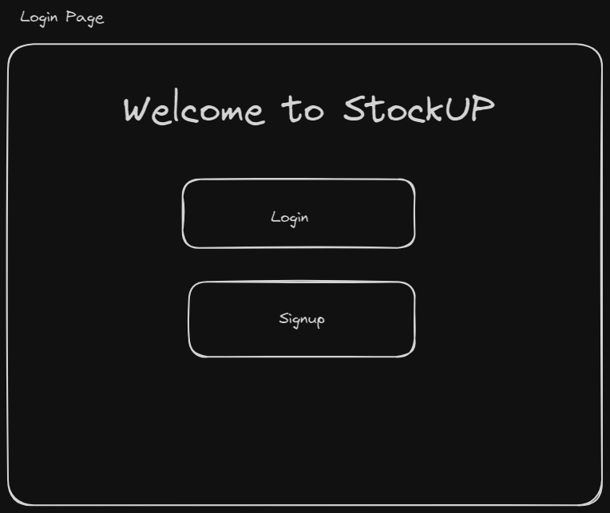
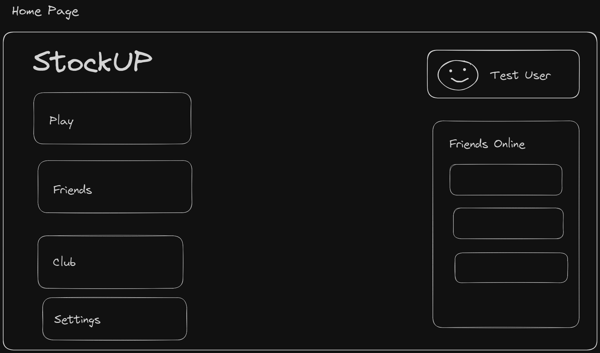
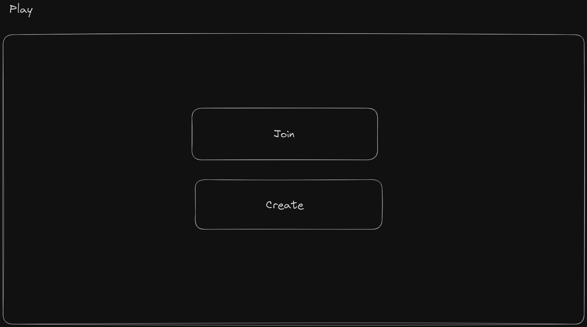
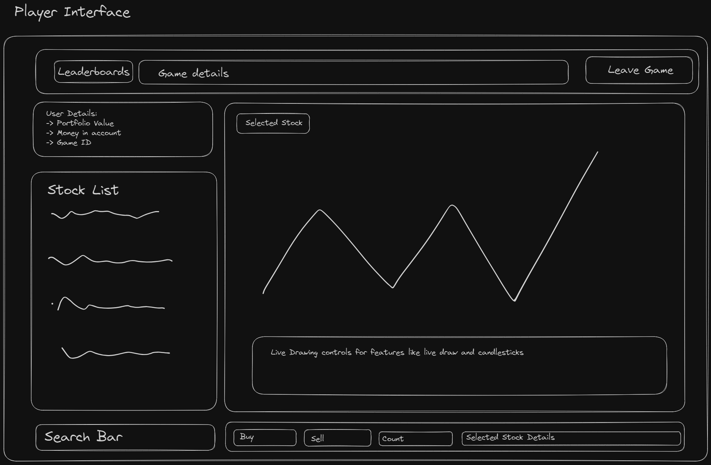
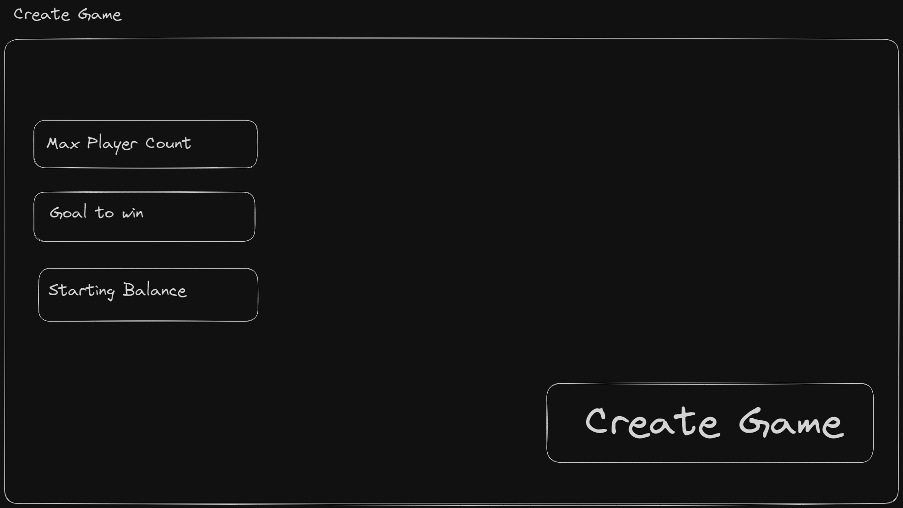
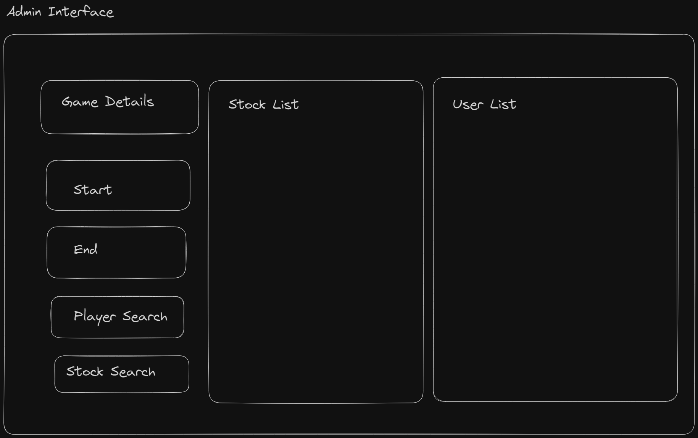
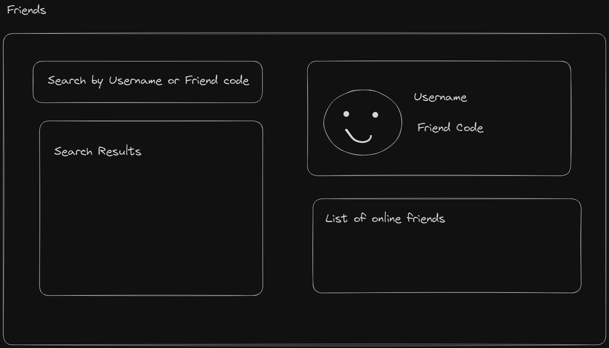

# Project Proposal

## Description

The stock trading game is a web application where players compete to have the highest-value portfolio at the end of the game/competition. Players can buy and sell stocks using their starting cash account, and the game supports features such as player registration, game configuration, tracking player portfolios, and declaring a winner. Admin users have the ability to create games and configure game parameters. Additional optional features include viewing competitor's portfolios, transaction fees, trade tracking, and game configuration settings. Players can also practice against bots to test
their methods without affecting their learderboard stats.

## Screens

### Login

### Home

### Play

### Player Interface

### Create

### Admin Interface

### Friends

## Features

| ID  | Name                  | Access By | Short Description                                  | Expected Implementation | Source of Idea         |
|-----|-----------------------|------------|----------------------------------------------------|--------------------------|------------------------|
| 01  | Player registration   | Player     | Players register for a specific game               | Must implement          | Project instructions  |
| 02  | Game duration         | Admin      | Configure start/end of each game individually      | Likely to be done        | Other games I know     |
| 03  | Moving Average        | Player     | An added feature to candlestick charts             | Probably not unless easy | Investopedia           |
| ... | ...                   | ...        | ...                                                | ...                      | ...                    |

*Note: Include 30 or more features in the actual proposal.*

## Implementation

### Tools and Packages
- Frontend: HTML, CSS, TypeScript, React
- Backend: Node.js
- Database: MongoDB
- Stock Price API: Alpha Vantage

### App API

1. `GET /portfolio?player=playername&game=gameid`: Responds with the current portfolio of the player.
2. `POST /sell?player=playername&game=gameid&stock=tickersymbol&quant=nnn`: Requests a pretend sale within the game, responds indicating stock sale success or failure and the price.

### Stock API

Use Alpha Vantage API for retrieving stock prices:

1. `GET /stocks/current?symbol=tickersymbol`: Retrieves the current stock price for a given symbol.
2. `GET /stocks/history?symbol=tickersymbol&interval=daily`: Retrieves historical stock prices for a given symbol.

## Moving Average (Feature ID: 03)

**Description:**
The moving average feature involves adding an additional layer to candlestick charts, providing users with a trend indicator. This can be implemented by calculating and plotting the moving average of stock prices over a specified period.

**Implementation:**
- Calculate the moving average based on the historical stock prices.
- Plot the moving average line on the candlestick chart for the player to observe trends.

## Attributions
I acknowledge the contribution of classmates in generating feature ideas during discussions.

---

*Note: The proposal is a template, and specific details, features, and attributions should be tailored to the project's requirements and context.*
